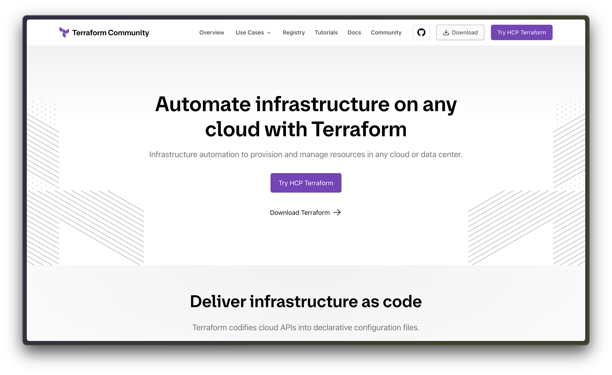
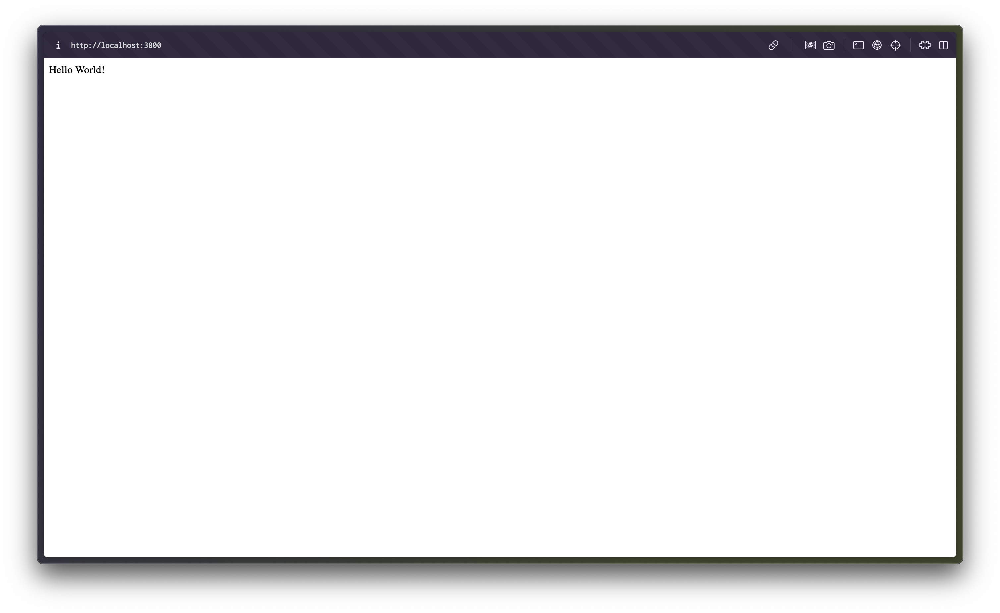
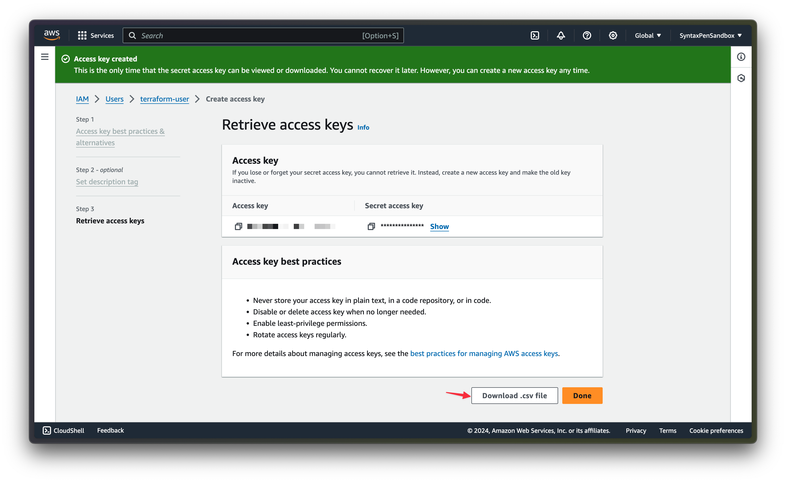
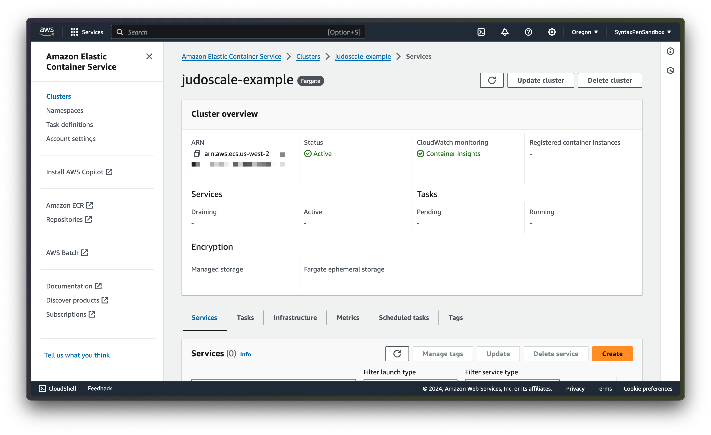
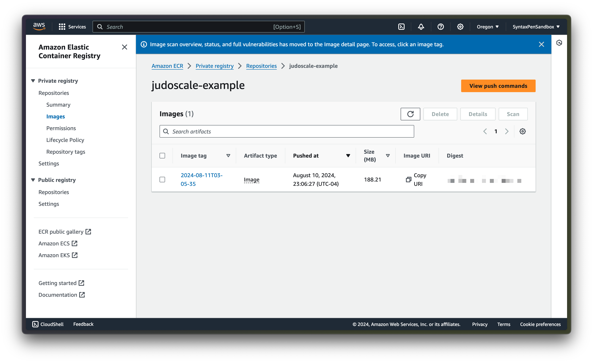
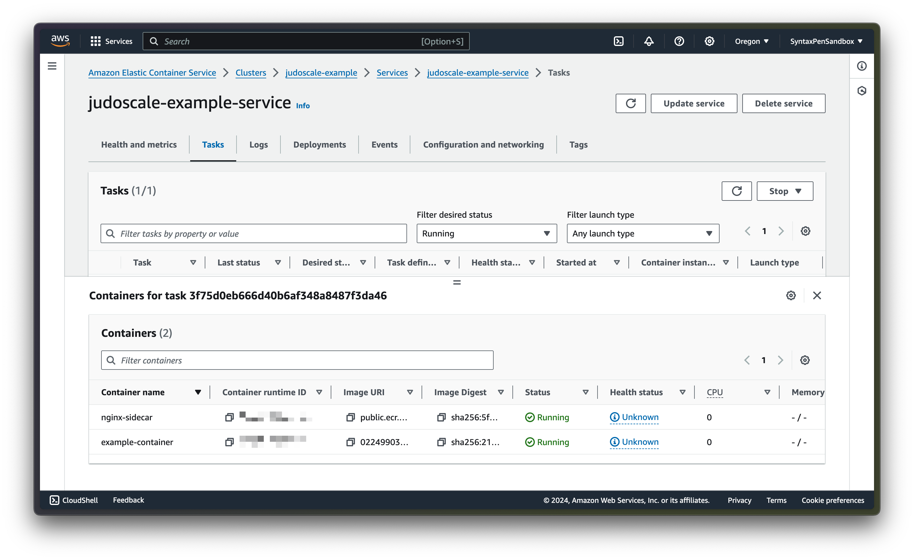

# Mastering AWS ECS Configuration with Terraform

Managing infrastructure for web applications is a complex endeavor, and using Amazon Web Services is no exception. Using an Infrastructure as Code tool like Terraform to provision and change resources for AWS makes the process more straight forward and repeatable. In this article, you'll learn how to create an ECS cluster with Terraform that runs a simple Node app in a Docker container.

To complete this tutorial, you'll need to have a few things installed, most notably:

- [NPM](https://docs.npmjs.com/downloading-and-installing-node-js-and-npm)
- [Terraform](https://developer.hashicorp.com/terraform/tutorials/aws-get-started/install-cli)
- [Docker](https://docs.docker.com/desktop/install/windows-install/)

First, we'll dig a little deeper into why the software industry loves Infrastructure as Code, and how Terraform plays in. Then, we'll write a quick example app that you can use if you aren't trying to deploy an existing project. Finally, we'll set up our infrastructure one piece at a time with Terraform. As we wrap up, we'll explore a bit about autoscaling and compare your options!

## Understanding Infrastructure as Code and Terraform

Whether your team is using a platform, a cloud provider, or even on-site hardware, configuring infrastructure is an unavoidable part of building software. Historically, developers and ops professionals have used user-interfaces to configure infrastructure. You can set up and make changes to AWS services using the AWS Management Console, but Infrastructure as Code (IaC) offers a better way.

[Infrastructure as Code](https://aws.amazon.com/what-is/iac/#:~:text=Infrastructure%20as%20code%20(IaC)%20is,%2C%20database%20connections%2C%20and%20storage.) refers to the practice of provisioning and managing infrastructure as text files, compared to using a UI. AWS offers Cloud Formation, its own product to manage AWS infrastructure with JSON and YAML files. While popular, a vendor-specific offering like this introduces some vendor lock-in, so some teams may wish to use a platform-independent IaC tool like Terraform.

[Terraform](https://www.terraform.io/) is a popular Infrastructure as Code tool that lets engineers manage infrastructure across many tools with the same human-readable language. With Terraform, you can provision cloud resources across all the major cloud providers (including AWS!), manage virtual machines, and even configure monitoring tools.



The reason that Terraform is so popular is that it leans on Providers, which are written in Go and often open source, to interpret Terraform files and make API calls to the correct providers. There are thousands of providers hosted on the Terraform registry, including [a provider for AWS](https://registry.terraform.io/providers/hashicorp/aws/latest)!

## What is AWS Elastic Container Service (ECS)?

Elastic Container Service (ECS) is a managed offering from AWS to orchestrate containers. Launching applications on ECS abstracts away the underlying cloud infrastructure, making managing and scaling applications easier.

You can use ECS in conjunction with EC2, another Amazon Web Services offering that lets you directly manage the underlying virtual server. This requires you to manage the EC2 instances themselves, which comes with its own complexity.

Fortunately, ECS also works with [AWS Fargate](https://aws.amazon.com/fargate/), serverless infrastructure made to run containers without the responsibility of managing the virtual server. In this tutorial, we'll use ECS with Fargate as the compute platform for our containers.

## Creating an AWS ECS Cluster with Terraform

### Building an example application

To show that our Terraform code effectively creates the resources needed to run a web application on ECS with Fargate, we'll build a quick example application to deploy. First, make a new directory for the app and initialize a new Node application with:

```bash
mkdir example-app && cd example-app && npm init
```

Next, create a new file in the root of the folder called `index.js`.

Next, [Install Express](https://expressjs.com/en/starter/installing.html):

```bash
npm install express
```

Finally, paste [the sample code for a Hello World application](https://expressjs.com/en/starter/hello-world.html) in a new file called `index.js`:

```js
const express = require('express')
const app = express()
const port = 3000

app.get('/', (req, res) => {
  res.send('Hello World!')
})

app.listen(port, () => {
  console.log(`Example app listening on port ${port}`)
})
```

Now that we have a minimal Node application that can listen for and respond to web requests, we need to containerize it. Create a new file, `Dockerfile`, in the root of the repository and paste the following into it:

```Dockerfile
FROM node:22-alpine

WORKDIR /app

EXPOSE 3000

COPY package*.json ./
RUN npm ci

COPY . .

CMD [ "node", "index.js"]
```

Finally, create a file called `.dockerignore` and paste the following in it to avoid Docker copying unwanted files. The following setup will ignore everything except `index.js`, `package-lock.json`, and `package.json`:

```
*
!index.js  
!package-lock.json  
!package.json
```

While we're at it, create a `.gitignore` file with the following contents:

```
node_modules/
```

Lastly, we'll build the Docker image and run a container to confirm that the application is working well in Docker. Build the Docker image by running:

```bash
docker build --tag example-app .
```

Then run the container with:

```bash
docker run --publish 3000:3000 example-app
```

You should see "Hello world!" when you visit `localhost:3000` in your browser now!



### Setting up Terraform

Let's get started creating resources on AWS with Terraform! To begin, make a new file in the root of your repository, `main.tf`, with the following starting code:

```tf
terraform {
  required_version = ">= 1.0"
  required_providers {
    aws = {
      source  = "hashicorp/aws"
      version = "~> 4.56"
    }
  }
}

# Configure AWS Provider
provider "aws" {
  region = "us-west-2"
}
```

This beginning of the Terraform configuration just sets up the AWS Terraform provider, which Terraform will use to turn the code into real AWS resources. We also set the AWS region, which you can customize to match your needs.

### Authenticating Terraform to AWS

Terraform will need to access AWS, so you'll need to create a new IAM user in the AWS console. Give it a memorable name, like `terraform-user`, then move on to set permissions. You'll need to attach policies directly. For a real project, you should follow the principle of least privledged access and only grant this IAM user the minimum access it needs. For simplicity in this tutorial, you can give it full rights with the `AdministratorAccess` policy. Create an access key for this user for CLI access. Finally, note the access key and secrete.

You can only view the secret once, so AWS gives you an option to download a CSV file with the key and secret.




Next, set the `AWS_ACCESS_KEY_ID` and `AWS_SECRET_ACCESS_KEY` environment variables on your system:

```bash
export AWS_ACCESS_KEY_ID="your-access-key"

export AWS_SECRET_ACCESS_KEY="your-secret-key"
```

Without these values, the AWS Terraform provider will not be able to authenticate to AWS.

### Creating a VPC

The first real piece of infrastructure we'll add (just below the existing Terraform setup) is a Virtual Private Cloud, or VPC. We'll use the [Terraform module for AWS VPC](https://registry.terraform.io/modules/terraform-aws-modules/vpc/aws/latest), which makes things pretty easy.

```tf
data "aws_availability_zones" "available" { state = "available" }

module "vpc" {
  source = "terraform-aws-modules/vpc/aws"
  version = "~> 3.19.0"

  azs = slice(data.aws_availability_zones.available.names, 0, 2) # Span subnetworks across 2 avalibility zones
  cidr = "10.0.0.0/16"
  create_igw = true # Expose public subnetworks to the Internet
  enable_nat_gateway = true # Hide private subnetworks behind NAT Gateway
  private_subnets = ["10.0.1.0/24", "10.0.2.0/24"]
  public_subnets = ["10.0.101.0/24", "10.0.102.0/24"]
  single_nat_gateway = true
}
```

We're actually at a point now where we can test our configuration so far to confirm it works. First, install the required providers by running:

```bash
terraform init
```

Then, provision the VPC specified in `main.tf` by running:

```bash
terraform apply
```

This will create the VPC and all that it needs - the VPC module we used handles a lot of things for us!

### Creating a load balancer

Next, we'll create an application load balancer with Terraform by adding the following to the bottom of `main.tf`:

```tf
module "alb" {
 source  = "terraform-aws-modules/alb/aws"
 version = "~> 8.4.0"

 load_balancer_type = "application"
 security_groups = [module.vpc.default_security_group_id]
 subnets = module.vpc.public_subnets
 vpc_id = module.vpc.vpc_id

 security_group_rules = {
  ingress_all_http = {
   type        = "ingress"
   from_port   = 80
   to_port     = 80
   protocol    = "TCP"
   description = "Permit incoming HTTP requests"
   cidr_blocks = ["0.0.0.0/0"]
  }
  egress_all = {
   type        = "egress"
   from_port   = 0
   to_port     = 0
   protocol    = "-1"
   description = "Permit outgoing requests"
   cidr_blocks = ["0.0.0.0/0"]
  }
 }

 http_tcp_listeners = [
  {
   port               = 80
   protocol           = "HTTP"
   target_group_index = 0
  }
 ]

 target_groups = [
  {
   backend_port         = 3000
   backend_protocol     = "HTTP"
   target_type          = "ip"
  }
 ]
}
```

Because we added a new module, `alb`, we'll need to run `terraform init` again to install it. Then, run `terraform apply` again. Terraform is smart enough to know that it already created the VPC, so it will just create the new resource, the load balancer.

### Creating an ECS Fargate Cluster

We're finally to the core of what we're trying to do! Add the following to the bottom of `main.tf`:

```terraform
module "ecs" {
  source  = "terraform-aws-modules/ecs/aws"
  version = "~> 4.1.3"

  cluster_name = "judoscale-example"

  fargate_capacity_providers = {
    FARGATE = {
      default_capacity_provider_strategy = {
      base   = 20
      weight = 50
      }
    }
    FARGATE_SPOT = {
      default_capacity_provider_strategy = {
      weight = 50
      }
    }
  }
}
```

You don't _have to_ run apply Terraform after every change, but it's an nice way to sanity check that each addition is doing what you intend. Run `terraform init` and `terraform apply` again.

Terraform gives you a confirmation of the success, but you're probably wondering if things are actually happening in AWS. At this point, it's easy to check! Go to the AWS dashboard for the region you selected in your Terraform code (in the example we use us-west-2), then go to Elastic Container Service and see your newly created cluster!



### Get the Docker container into AWS

The goal of this tutorial is to have the Docker container we built locally in the beginning running on AWS, so we have to set up terraform to make that happen. First, we'll need to install the Docker Terraform provider. Edit the `required_providers` block at the beginning of your `main.tf` to include the Docker provider in addition to the existing AWS provider:

```terraform
required_providers {
  aws = {
    source  = "hashicorp/aws"
    version = "~> 4.56"
  }
  docker = {
    source  = "kreuzwerker/docker"
    version = "~> 3.0.2"
  }
}
```

Next, add the following to the bottom of `main.tf` to create an Elastic Container Registry and build and push an image to it when running Terraform:

```terraform
data "aws_caller_identity" "this" {}
data "aws_ecr_authorization_token" "this" {}
data "aws_region" "this" {}
locals { ecr_address = format("%v.dkr.ecr.%v.amazonaws.com", data.aws_caller_identity.this.account_id, data.aws_region.this.name) }
provider "docker" {
  registry_auth {
    address  = local.ecr_address
    password = data.aws_ecr_authorization_token.this.password
    username = data.aws_ecr_authorization_token.this.user_name
  }
}

module "ecr" {
  source  = "terraform-aws-modules/ecr/aws"
  version = "~> 1.6.0"

  repository_force_delete = true
  repository_name = "judoscale-example"
  repository_lifecycle_policy = jsonencode({
    rules = [{
      action = { type = "expire" }
      description = "Delete old images"
      rulePriority = 1
      selection = {
        countNumber = 3
        countType = "imageCountMoreThan"
        tagStatus = "any"
      }
    }]
  })
}

resource "docker_image" "exampleimage" {
  name = format("%v:%v", module.ecr.repository_url, formatdate("YYYY-MM-DD'T'hh-mm-ss", timestamp()))
  build { context = "." } # Path
}

resource "docker_registry_image" "exampleimage" {
  keep_remotely = false
  name = resource.docker_image.exampleimage.name
}
```


Install the new Docker provider with `terraform init` and apply the plan with `terraform apply`. After the plan succeeds, go to the AWS dashboard and find the Elastic Container Registry list for your selected region. You'll see the newly created container registry, and inside it, a single Docker image!




### Creating an ECS Task Definition

An ECS cluster is not very useful on its own. We'll use Terraform to create an [ECS task definition](https://docs.aws.amazon.com/AmazonECS/latest/developerguide/task_definitions.html) that defines our application. Add the following to the bottom of `main.tf`:

```terraform
resource "aws_iam_role" "ecsTaskExecutionRole" {
  name               = "ecsTaskExecutionRole"
  assume_role_policy = "${data.aws_iam_policy_document.assume_role_policy.json}"
}

data "aws_iam_policy_document" "assume_role_policy" {
  statement {
    actions = ["sts:AssumeRole"]

    principals {
      type        = "Service"
      identifiers = ["ecs-tasks.amazonaws.com"]
    }
  }
}

resource "aws_iam_role_policy_attachment" "ecsTaskExecutionRole_policy" {
  role       = "${aws_iam_role.ecsTaskExecutionRole.name}"
  policy_arn = "arn:aws:iam::aws:policy/service-role/AmazonECSTaskExecutionRolePolicy"
}

resource "aws_ecs_task_definition" "this" {
  container_definitions = jsonencode([{
    essential = true,
    image = resource.docker_registry_image.exampleimage.name,
    name = "example-container",
    portMappings = [{ containerPort = 3000, hostPort = 3000 }],
  }])
  cpu = 256
  execution_role_arn = "${aws_iam_role.ecsTaskExecutionRole.arn}"
  family = "family-of-judoscale-example-tasks"
  memory = 512
  network_mode = "awsvpc"
  requires_compatibilities = ["FARGATE"]

  # Only set the below if building on an ARM64 computer like an Apple Silicon Mac
  runtime_platform {
    operating_system_family = "LINUX"
    cpu_architecture        = "ARM64"
  }
}
```

This creates both the ECS task and IAM role it needs.

You'll notice that there's a `runtime_platform` section in the ECS Task resource - if you're building your Docker container on an ARM64 machine like an Apple Silicon Mac, you'll need this section. If not, you'll need to remove it!

Run `terraform apply` to create this task definition.

### Creating an ECS Service

Next, we'll use Terraform to create an ECS service, which manages the task we just created.

```terraform
resource "aws_ecs_service" "this" {
  cluster = module.ecs.cluster_id
  desired_count = 1
  launch_type = "FARGATE"
  name = "judoscale-example-service"
  task_definition = resource.aws_ecs_task_definition.this.arn

  lifecycle {
    ignore_changes = [desired_count]
  }

  load_balancer {
    container_name = "example-container"
    container_port = 3000
    target_group_arn = module.alb.target_group_arns[0]
  }

  network_configuration {
    security_groups = [module.vpc.default_security_group_id]
    subnets = module.vpc.private_subnets
  }
}

output "public-url" { value = "http://${module.alb.lb_dns_name}" }
```

Run `terraform apply` again. Once completed, this will output the public-facing URL for your application! Give it some time to finish the deploy, then visit the URL in your browser to see "Hello World!" from inside AWS!

### Setting up an NGINX Sidecar

You may wish to use an NGINX sidecar with your application for a number of reasons, such as using [an autoscaler like Judoscale](https://judoscale.com/docs/aws-getting-started). To do this with Terraform, we'll make a quick change to our Task Definition to also deploy [Judoscale's sidecar container](https://gallery.ecr.aws/b1e6w9f4/nginx-sidecar-start-header) from the public container registry. Replace the existing task definition with this:

```terraform
resource "aws_ecs_task_definition" "this" {
  container_definitions = jsonencode([
    {
      essential = true,
      image = resource.docker_registry_image.exampleimage.name,
      name = "example-container",
      portMappings = [{ containerPort = 3000, hostPort = 3000 }],
    },
    {
      essential = true,
      image = "public.ecr.aws/b1e6w9f4/nginx-sidecar-start-header:latest",
      name = "nginx-sidecar",
      portMappings = [{ containerPort = 80, hostPort = 80 }],
    }
  ])
  cpu = 256
  execution_role_arn = "${aws_iam_role.ecsTaskExecutionRole.arn}"
  family = "family-of-judoscale-example-tasks"
  memory = 512
  network_mode = "awsvpc"
  requires_compatibilities = ["FARGATE"]

  # Only set the below if building on an ARM64 computer like an Apple Silicon Mac
  runtime_platform {
    operating_system_family = "LINUX"
    cpu_architecture        = "ARM64"
  }
}
```

Next, we'll change our load balancer to distribute traffic to this NGINX container instead of the web container. The NGINX container will add the needed header, then send the traffic to the container running our app. In the `alb` module, change the `target_groups` to be this:

```terraform
 target_groups = [
  {
   backend_port         = 80
   backend_protocol     = "HTTP"
   target_type          = "ip"
  }
 ]
```

Then, apply the changes with `terraform apply`. After waiting some time for the deploy, click the link that Terraform outputs and you'll still see "Hello world!". This shows off some of the convenience of Terraform - we were able to make a pretty complex infrastructure way in just a few lines of code!

You can go into the AWS console yourself to see cluster, the service, the task, and both containers running!



If you're having any problems at all, compare your code to the [example project's completed Terraform configuration](https://github.com/JeffMorhous/aws-ecs-with-terraform/blob/main/main.tf).

If you were following along with tutorial just to learn, then you probably want to delete the AWS resources you created along the way to avoid charges. Deleting resources with Terraform is just as easy as making any other change. Just run

```bash
terraform destroy
```

## Autoscaling ECS with Queue Time

AWS's built-in ECS autoscaler, which manages the number of tasks running in your service, works by monitoring CPU utilization and memory usage of your tasks. When these metrics exceed certain thresholds, it automatically adds more tasks to handle the increased load.

While CPU and memory metrics are useful, they show a limited view into an application's performance. For web apps, [one metric that often gets overlooked is queue time](https://judoscale.com/blog/request-queue-time), the duration between when a request hits your server and when your application starts processing it. **High queue times often indicate that your application is struggling to keep up with incoming requests, even if CPU and memory usage seem normal.**

Autoscaling based on queue time can provide more responsive scaling when compared to using memory and CPU. Judoscale offers the ability to [scale ECS applications based on queue time](https://judoscale.com/aws). By monitoring your application's queue time, Judoscale can scale more precisely, helping you maintain performance without overspending on resources optimizing resource usage.

Regardless of your autoscaling choice, Terraform is a powerful option for managing your cloud resources. While this article went over the configuration one piece at a time, you may want to reference the [final example project on GitHub](https://github.com/JeffMorhous/aws-ecs-with-terraform).

